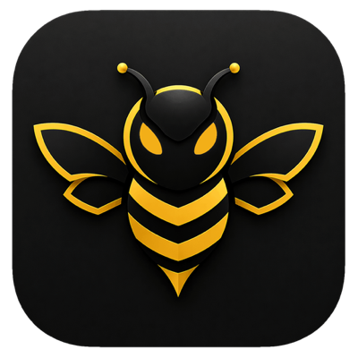

<p align="center"></p>

# Bee by HEOSSI

[](https://www.npmjs.com/package/@heossihq/bee)
[](https://pypi.org/project/bee-sdk/)
[](https://registry.modelcontextprotocol.io/v0/servers?search=io.github.heossihq/bee-public)
[](./LICENSE)

[Website](https://bee.heossi.com) | [Documentation](https://bee.heossi.com/docs) | [Packages](./PACKAGES.md) | [Machine-readable package index](./PACKAGE-INDEX.json) | [System status](https://bee.heossi.com/status)

The public developer distribution for [Bee](https://bee.heossi.com), HEOSSI's governed multimodal intelligence platform. This repository contains the actual source of Bee's Apache-2.0 SDKs, MCP integration, API contracts, runnable examples, and public trust-verification material.

> This repository is generated from reviewed, public-safe paths in the Bee monorepo. [MANIFEST.json](./MANIFEST.json) records the exact source commit and content digest for every export; [SHA256SUMS](./SHA256SUMS) and the [SPDX SBOM](./SBOM.spdx.json) support independent artifact inspection.

<!-- mcp-name: io.github.heossihq/bee-public -->

## Developer surface

The canonical [package catalog](./PACKAGES.md) records each public developer distribution, exact version, registry, role, license boundary, and install command. Its machine-readable companion is [`PACKAGE-INDEX.json`](./PACKAGE-INDEX.json). These distributions do not expose the private Bee service monorepo.

| Surface | Install or entry point | Source / contract |
| --- | --- | --- |
| TypeScript SDK | `npm install @heossihq/bee` | [`sdks/typescript`](./sdks/typescript) |
| Python SDK | `pip install bee-sdk` | [`sdks/python`](./sdks/python) |
| MCP server | `uvx --from bee-sdk@latest bee-mcp` | [`mcp`](./mcp) · [`server.json`](./sdks/python/server.json) |
| OpenAI-compatible API | `https://api.bee.heossi.com/bee` | [`openapi.json`](./api/openapi.json) · [`postman.json`](./api/postman.json) |
| BEE Code for VS Code | `Heossi.beecode` | [Microsoft Marketplace](https://marketplace.visualstudio.com/items?itemName=Heossi.beecode) · [Open VSX](https://open-vsx.org/extension/Heossi/beecode) |
| Bee Code CLI | `npm install -g @heossihq/beecode` | [Download guide](https://bee.heossi.com/download) |
| PQ assurance | Signed public coverage register | [`trust/pq-register`](./trust/pq-register) |

## Quickstart

```ts
import { BeeClient } from "@heossihq/bee";

const bee = new BeeClient({ apiKey: process.env.BEE_API_KEY! });
const result = await bee.chat.completions.create({
  model: "bee-cell",
  messages: [{ role: "user", content: "Explain hybrid post-quantum TLS." }],
});

console.log(result.choices[0].message.content);
```

Create an API key in [Bee Workspace](https://workspace.bee.heossi.com/account/api-keys). The free Cell tier works with both SDKs and MCP.

## Repository map

```text
api/                 Versioned OpenAPI and Postman contracts
docs/                Public architecture and enterprise scenario flows
examples/            Runnable TypeScript and Python examples
mcp/                 Client configuration and MCP setup
sdks/typescript/     Published @heossihq/bee package source and tests
sdks/python/         Published bee-sdk and bee-mcp source and tests
trust/pq-register/   Public PQ coverage register and offline verification tools
```

## Enterprise evaluation paths

| Evaluator | Start here | What can be verified publicly |
| --- | --- | --- |
| Enterprise architect | [Reference architecture](./docs/architecture.md) and [scenario flows](./docs/scenarios/README.md) | System boundaries, governed request flow, deployment profiles, and responsibility split |
| Security or risk lead | [Security policy](./SECURITY.md), [PQ coverage register](./trust/pq-register/), and [diligence index](./docs/enterprise-diligence.md) | Disclosure path, released PQ claims, evidence limitations, and public control references |
| Platform engineer | [API contracts](./api/), [SDKs](./sdks/), [MCP](./mcp/), and [examples](./examples/) | Integration contracts, install paths, source, examples, and client configuration |
| Procurement or technical diligence | [MANIFEST.json](./MANIFEST.json), [SHA256SUMS](./SHA256SUMS), [SPDX SBOM](./SBOM.spdx.json), and [NOTICE](./NOTICE) | Export provenance, file integrity, package inventory, licensing, and the public/proprietary boundary |

## Architecture and scenarios

Start with the [public reference architecture](./docs/architecture.md), then
follow the control boundary through three concrete flows:

- [governed coding in an IDE](./docs/scenarios/bee-code.md)
- [tenant-scoped knowledge retrieval](./docs/scenarios/tenant-rag.md)
- [explicit quantum reasoning](./docs/scenarios/quantum-reasoning.md)

The matching visual architecture centre is published at
[bee.heossi.com/docs/architecture](https://bee.heossi.com/docs/architecture).

Bee Code's agent path is durable, subscription-bounded, and independently
metered. Workspace, mobile, desktop, SDK, and MCP requests retain their own
documented execution contracts; common entitlement enforcement does not imply
that every surface has local IDE tools.

## Integrity and provenance

The public distribution is locally rendered from an allowlisted monorepo
surface. Verify it with:

```bash
sha256sum --check SHA256SUMS
python3 scripts/verify_bee_package_index.py PACKAGE-INDEX.json
```

`SHA256SUMS` covers every exported payload file except itself and the
commit-specific `MANIFEST.json`. The manifest separately binds the export to
its source commit and contains a deterministic digest of the complete payload.
The SPDX document is package-level (`filesAnalyzed: false`); it inventories the
published SDK and MCP packages without claiming a binary or deployment SBOM.

## Public and proprietary boundary

The files in this repository are Apache-2.0 licensed. Bee's model engine, orchestration plane, hosted gateway, Bee Code CLI implementation, editor-extension implementation, and commercial applications remain proprietary and are not represented as open source here. Public API and package behavior is defined by the contracts and SDK source in this repository.

## Support and security

- SDK, MCP, contract, or example defect: [open an issue](https://github.com/heossihq/bee-public/issues)
- Product or account support: [bee.heossi.com/contact](https://bee.heossi.com/contact)
- Vulnerability disclosure: `bee-security@heossi.com`; see [SECURITY.md](./SECURITY.md)
- Service health: [status](https://bee.heossi.com/status) · [changelog](https://bee.heossi.com/changelog) · [roadmap](https://bee.heossi.com/roadmap)

## Contributing

Read [CONTRIBUTING.md](./CONTRIBUTING.md), [SUPPORT.md](./SUPPORT.md), and the [Code of Conduct](./CODE_OF_CONDUCT.md). Generated paths must be changed in their canonical monorepo source; community examples and documentation can be proposed here and are reconciled during the next local export.

## License

[Apache License 2.0](./LICENSE) · Copyright 2026 HEOSSI (Pte.) Ltd.
