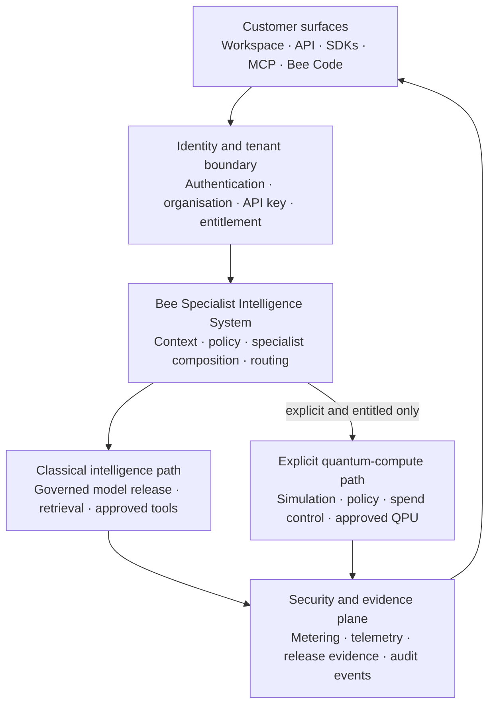
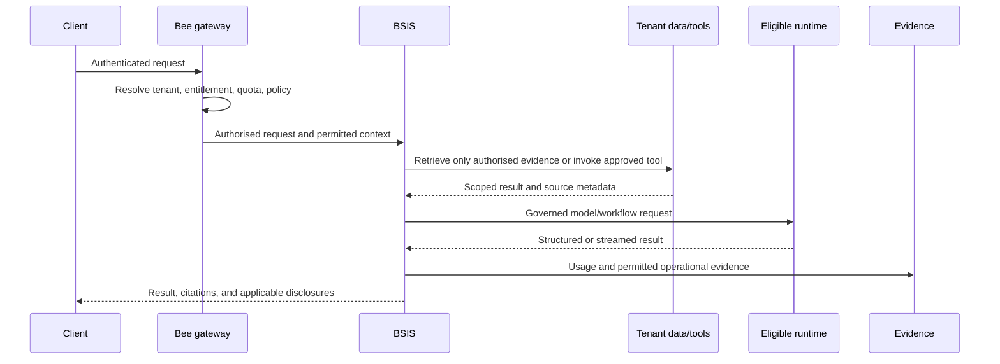

# Bee public reference architecture

This document describes the public system contract for Bee integrations. It is
an architectural view, not the proprietary implementation of the Bee
Specialist Intelligence System (BSIS). Customer-specific controls, locations,
operators, and service levels are fixed in the applicable Order Form and
deployment manifest.

## System boundary

The public browser, SDK, MCP, and editor clients do not call inference workers
directly. The authenticated gateway resolves the account, tenant, model access,
rate and applicable policy before selecting an eligible execution path.

Bee Code for VS Code and the Bee Code CLI use the durable agent route. Workspace,
mobile, and desktop use the Workspace chat and product routes. SDK and MCP calls
perform only their documented API operation; they do not implicitly start an
IDE agent run. These surfaces share subscription authority, not identical local
capabilities.

## Governed request lifecycle

## Deployment profiles

| Profile | Current public posture | Responsibility boundary |
| --- | --- | --- |
| Bee hosted cloud | Live | Multi-tenant service with logical tenant isolation, operated by HEOSSI |
| Bee Regulated Cloud | Customer-scoped | Placement and controls are defined for the engagement |
| Bee Enclave | Customer-scoped | Dedicated customer boundary defined by contract and deployment manifest |
| Broader self-hosted or air-gapped operation | Roadmap | Availability must not be inferred before a specific architecture is confirmed |

Public service endpoints use TLS 1.3. Post-quantum transport is a separately
scoped Enclave control and is not implied for every public connection. The
signed [public PQ coverage register](../trust/pq-register/) records the
verifiable coverage claims released for inspection.

## Sources of truth

- Machine API behavior: [`api/openapi.json`](../api/openapi.json)
- SDK behavior: [`sdks/typescript`](../sdks/typescript/) and
  [`sdks/python`](../sdks/python/)
- MCP surface: [`mcp`](../mcp/)
- Public export provenance: [`MANIFEST.json`](../MANIFEST.json)
- Live product status: [bee.heossi.com/status](https://bee.heossi.com/status)
- Enterprise evidence and availability:
  [bee.heossi.com/enterprise](https://bee.heossi.com/enterprise)

## What this diagram does not claim

- It does not represent every model as continuously hot; eligible inference
  capacity can scale to zero and warm on demand.
- It does not imply that ordinary chat invokes quantum hardware.
- It does not make customer-scoped Enclave controls universally available.
- It does not expose or license Bee's proprietary orchestration or model-engine
  source.
- It does not imply that every client can edit files, control a browser, or use
  an MCP tool. Local effects require a supporting client, an installed tool, and
  explicit approval.
