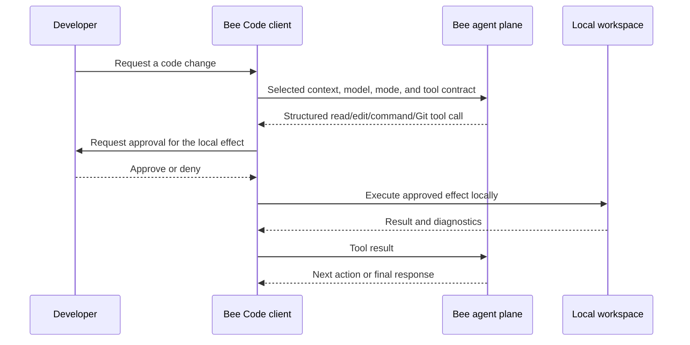

# Scenario: governed coding in an IDE

Bee Code separates the hosted model turn from effects inside the developer's
workspace. The client owns the transcript and approval loop; the agent API is
stateless between turns.

## Controls and evidence

| Control | Behavior |
| --- | --- |
| Path boundary | Workspace paths are confined; configured secret paths are denied |
| Commands | Executed as argument arrays rather than shell strings |
| Effects | Edits, commands, and publication actions follow the selected approval mode |
| Git | Dedicated Git tools preserve publication approvals and commit policy |
| Attribution | Bee-created commits add the selected Bee model release by default; users can opt out |
| Recovery | Local checkpoints support conversation branching and file rewind |

The developer remains the primary Git author. A default trailer such as
`Co-Authored-By: Bee Cell v1.0 <bee-noreply@heossi.com>` records the assisting
model without replacing the developer's identity.

This scenario does not claim that the editor-extension or CLI implementation is
open source; their public API and installation surfaces are listed in the
repository [README](../../README.md).
