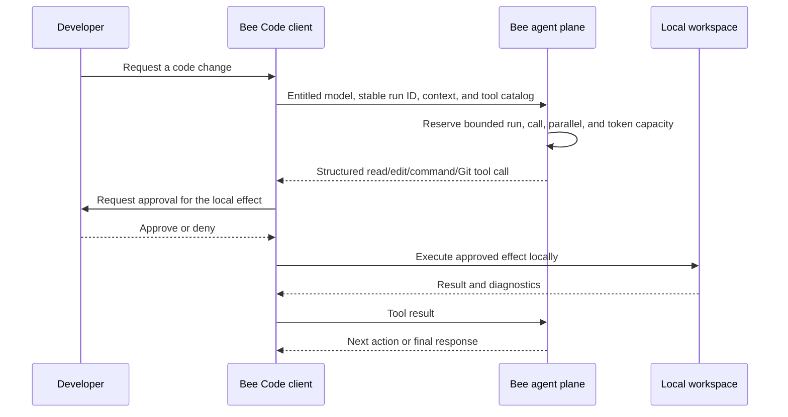

# Scenario: governed coding in an IDE

Bee Code separates the hosted model turn from effects inside the developer's
workspace. The client owns the transcript and approval loop; the agent API is
backed by an account-scoped durable run while the local transcript and effects
remain on the developer's machine.

## Controls and evidence

| Control | Behavior |
| --- | --- |
| Path boundary | Workspace paths are confined; configured secret paths are denied |
| Commands | Executed as argument arrays rather than shell strings |
| Effects | Edits, commands, and publication actions follow the selected approval mode |
| Git | Dedicated Git tools preserve publication approvals and commit policy |
| Attribution | Bee-created commits add the selected Bee model name by default; users can opt out |
| Recovery | Local checkpoints support conversation branching and file rewind |
| Orchestration | Subscription-bounded manager, specialist waves, and independent verification |
| External tools | Only tools registered in VS Code are advertised; each MCP or external invocation requires fresh approval |
| Metering | Every manager, specialist, and verifier call is metered and settled independently |

The developer remains the primary Git author. A default trailer such as
`Co-Authored-By: Bee Cell <bee-noreply@heossi.com>` records the assisting
model without replacing the developer's identity.

This scenario does not claim that the editor-extension or CLI implementation is
open source; their public API and installation surfaces are listed in the
repository [README](../../README.md).

Logical workers are bounded task decompositions, not continuously hot GPUs.
Cell remains a single-manager path; higher subscriptions progressively raise
the permitted decomposition and concurrency. The lower of the subscription and
selected model always applies before model capacity is provisioned.
