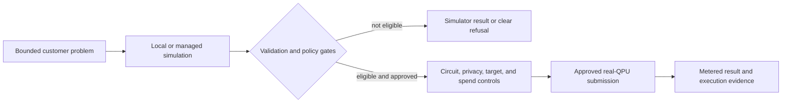

# Scenario: explicit Quantum Reasoning Lab workflow

Ordinary Bee requests remain on the classical intelligence path. A quantum
workload is a separate, explicit, entitled and budget-controlled decision.

## Required separation

- Hardware execution is never an implicit side effect of chat or model
  selection.
- Simulation precedes real-QPU submission where the workflow requires it.
- Entitlement, privacy, circuit shape, target availability, and spend limits
  are evaluated before submission.
- A provider artifact or simulator result is not represented as proof that real
  quantum hardware ran.
- Availability and supported targets are operational facts and may change; use
  the [live Quantum page](https://bee.heossi.com/quantum) for the current
  customer-facing boundary.
