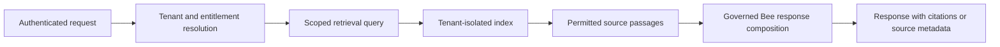

# Scenario: tenant-scoped knowledge retrieval

Bee retrieval adds authorised source passages to a request without silently
changing model weights or granting access to another tenant's documents.

| Stage | Boundary |
| --- | --- |
| Upload | The credential and tenant determine the document owner |
| Indexing | Chunks and embeddings remain associated with the tenant scope |
| Retrieval | The query searches only indexes authorised for that request |
| Generation | Retrieved passages are context, not a model-weight update |
| Output | Citations preserve the link between claims and supplied evidence |

Cross-member shared context is not implied by basic tenant retrieval. Current
availability and product limitations remain published in the
[enterprise centre](https://bee.heossi.com/enterprise) and
[roadmap](https://bee.heossi.com/roadmap).
